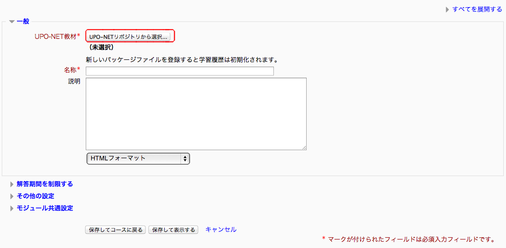
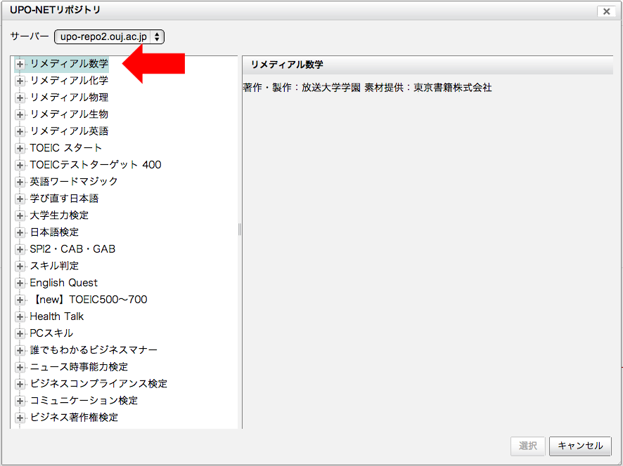

#活動(3)：その他（概要紹介）
* [テキストのフォーマットについて](#formatOfText)
* [UPO-NETパッケージ](#uponet)
* 小テスト
* フォーラム
* ワークショップ
* 投票
* アンケート

## <a name="formatOfText">テキストのフォーマットについて</a>
##<a name="uponet">UPO-NETパッケージ</a>
###UPO-NETとは
UPO-NETについて「UPO-NETオンライン学習大学ネットワーク」で以下のように紹介されている
>放送大学が高等教育機関などのeラーニングの普及、拡大、また多様なメディアを活用した教育の実現に資することを目的に行っている事業「オンライン学習大学ネットワーク」で、UPO-NETはその愛称です。
大学などが必要としている基礎教育、初年次教育、リメディアル教育、キャリア教育などのeラーニング教材を作成、提供して、eラーニングの取り組みを後押しします。

「活動またはリソースを追加する」でUPO-NETパッケージを選択すると、UPO-NET教材を利用できる

###利用手順
1. moodleにログインする
1. UPO-NETパッケージを追加したいコースを選択し、コースに入ったら「編集モード」にする
1. UPO-NETパッケージを追加したいトピックの をクリック
1. UPO-NETパッケージを選択しをクリック

	
	
	

1. をクリック
	
1. 以下のような画面が開くので学生に取り組ませたい課題を選択しをクリック
	
1. UPO-NETの課題を選択したら残りの項目を設定する
1. 設定が完了したらかをクリックして編集を終了する

【参考文献】

放送大学 教育支援センター, 谷本, 西嶋,茂原. "UPO-NETとは". UPO-NETオンライン学習大学ネットワーク. 2009. http://upo-net.ouj.ac.jp/about/, (accessed 2013-8-26).

放送大学 教育支援センター, 谷本, 西嶋,茂原. "[Moodle 2.x版] UPO-NET利用マニュアル - 教員向け". UPO-NETオンライン学習大学ネットワーク. 2013/01/07. http://upo-net.ouj.ac.jp/technical/4.html, (accessed 2013-08-28).