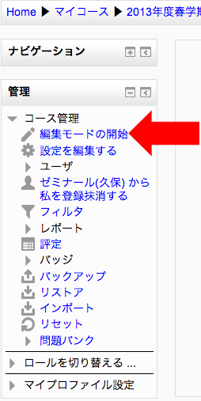
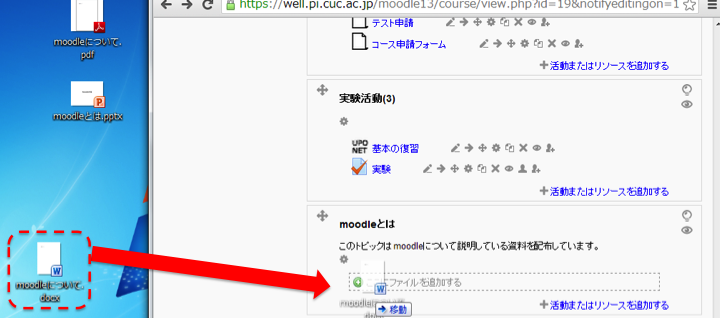
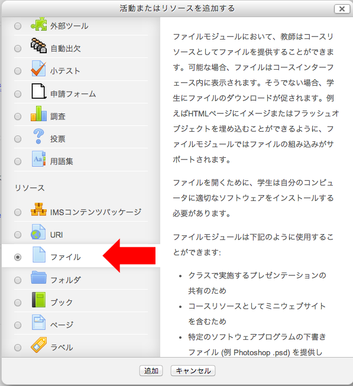
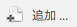
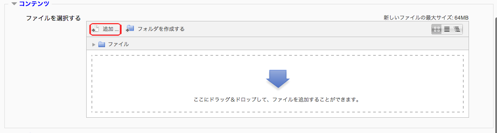
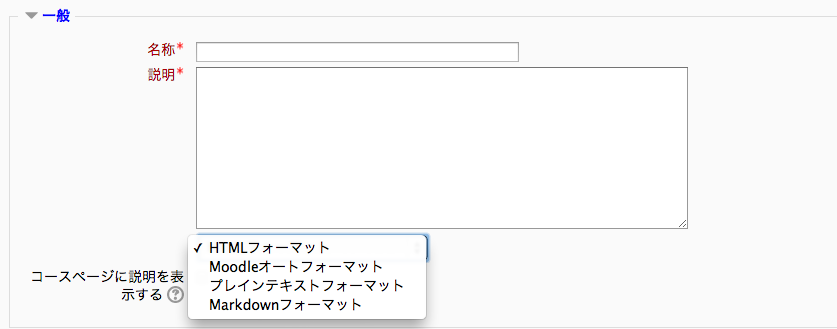

#講義資料ファイルのオンライン配布のデモストレーション手順

##ブラウザがドラッグアンドドロップによるファイルアップロードに対応している場合
ドラッグアンドドロップによるファイルアップロードが可能なのは以下の表の条件に当てはまるブラウザのみ

|ブラウザ|バージョン|
|:-|:-|
|Internet Explorer|8以上|
|Firefox| 4以上|
|Safari| 5以上|
|Google Chrome| 11以上|

1. moodleにログインする
2. 講義資料ファイルをオンライン配布したいコースに入る
3. 「管理ブロック」の編集モードをクリック

	
	
4. 講義資料ファイルを追加したいトピックにファイルをドラッグアンドドロップ。
	
	
	

5. ファイルがアップロードできたか確認する

##ブラウザがドラッグアンドドロップによるファイルアップロードに対応していない場合

1. moodleにログインする
2. 講義資料ファイルをオンライン配布したいコースに入る
3. 編集モードにする
4. 講義資料ファイルを追加したいトピックのをクリックすると以下の図のような画面が表示されるので「ファイル」を選択し「追加」ボタンをクリックする
	
	
5. 名称と説明を入力する
6. コンテンツのをクリックしファイルを選択する。必要があれば名前を付けて保存やライセンス選択などを行う
	
	

7. をクリック
8. 設定が完了したらかをクリックして編集を終了する

#編集モードについて
編集モードは教員権限を持ったユーザーしか使えない。また編集モードにしなければ教員としてファイルのアップロードやコース内の編集などを行うことが出来ない。

***コースを編集するときは必ず編集モードにすること。***

#テキストフォーマットについて
トピックに活動を追加すると以下のような画面が表示され、そ

【参考】

株式会社テクノウォーカー. 「Moodle情報サイト」. Moodle情報サイト. 2013. http://www.twalker.co.jp/moodle/basics/basic_moodle24.html, (参照 2013-9-3).
