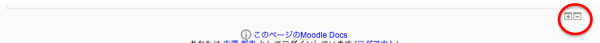
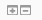
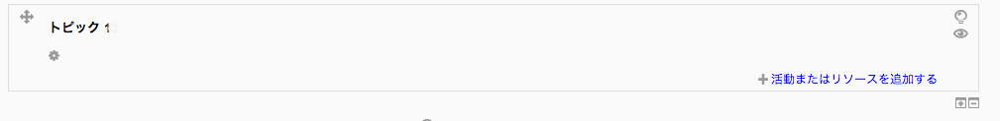
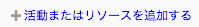
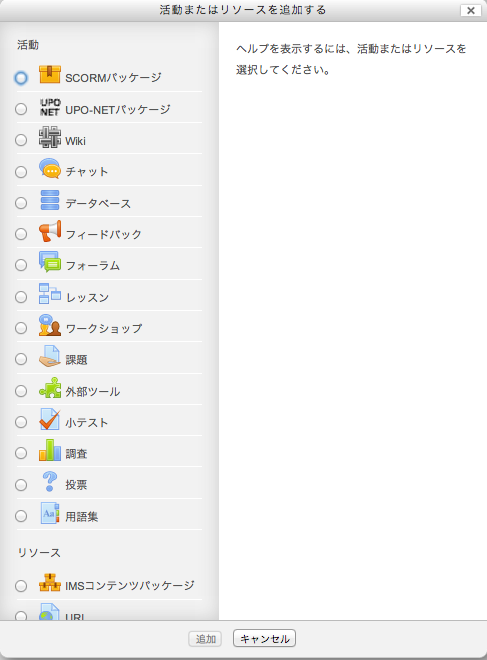
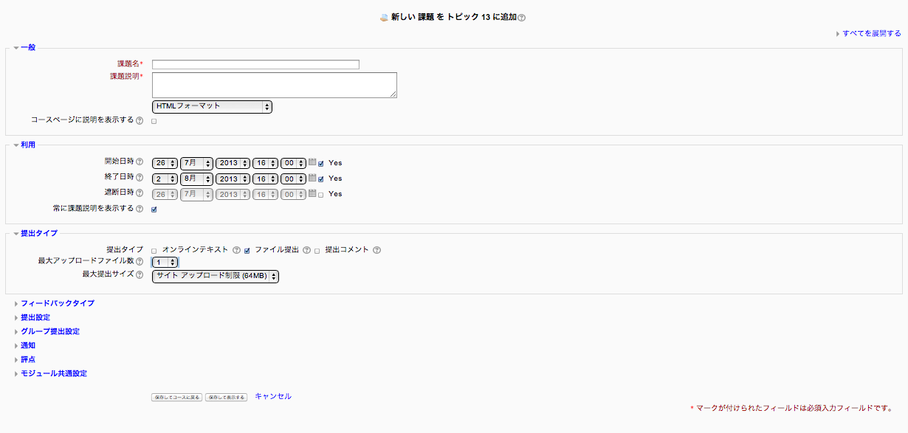

#課題の提出から採点まで
##<a name="proposingQuestion">教員が行う課題の出題方法</a>

1. moodleにログインして課題を設置するコースを選択します。

1. 左の**「ナビゲーション」**バーの下の**「管理」**バーのコース管理をクリック、現れた項目の**「編集モードの開始」**をクリック

1. 画面の中央に

	
が表示されているので「＋」をクリックします。また、すでに複数のトピックがある場合、は一番下に表示されるので注意してください。

1. 以下のようにトピックが出来たら
をクリックします。

1. 以下の様なウィンドウが開きます。

パワーポイントやワードなど、決まった課題をアップロードさせる場合には
	を選択し下にある追加ボタンをクリックします。

1. 追加ボタンをクリックすると以下のようにトピック編集画面が表示されます。

編集画面についての説明をカテゴリ別(上記の画像の青字で表示されている項目)に以下で説明します。
* 一般
	* 課題名	
	
		学生に提出する課題名を入力します。
		
	* 課題説明
	
		学生にむけた課題の説明を入力します。
		
	* テキストフォーマット
	
		テキストフォーマットの形式としてプルダウンで以下の項目を選択出来ます。通常はMoodleオートフォーマットを使用してください。
			* HTMLフォーマット
			* Moodleオートフォーマット
			* プレインテキストフォーマット
			* Markdownフォーマット
			
	* コースページに説明を表示する
	
		コースページに説明を表示するかをチェックボックスをクリックして選択してください。

* 利用
	* 開始日時
	
		課題の受付を始める日時、時間を設定出来ます。
	
	* 終了日時
	
		課題の受付を終了する日時、時間を設定出来ます。
		
	* 遮断日時
	
		終了日時を超えて提出する学生に延長期限を与えることができる。
* 提出タイプ
	
	* 提出タイプ
		
		以下の3つのタイプを選択することができます。
			* オンラインテキスト	
			* ファイル提出
			* 提出コメント
				
	* 最大アップロード数
		
		ファイルのアップロード数の上限を指定することができます。
		
	* 最大提出ファイル
	
		学生がアップロードするファイルの上限サイズを指定出来ます。
	

##<a name="fileUpload">学生が行うファイルの提出方法</a>
##<a name="submissionStatus">提出状況の確認と採点用ウィンドウの開き方</a>
##<a name="howToGrading">採点の方法</a>
##<a name="doQuiz">小テストの実施</a>


[目次へ戻る](../moodleManual.md)



