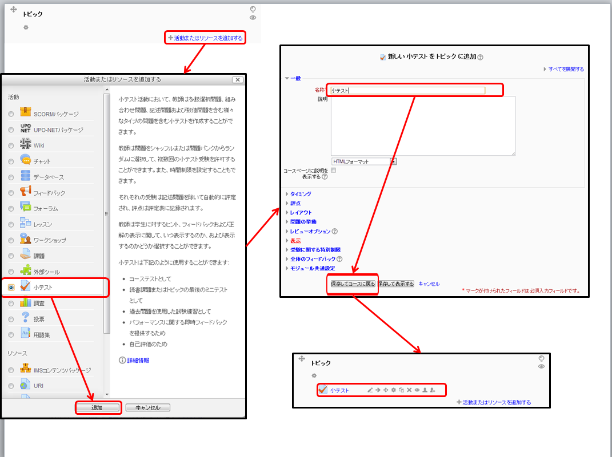

#小テストの実施について

 Moodleではオンラインで小テストを実施することができます。「小テスト」は複数の「問題」によって構成されます。あらかじめ「問題」として問題文や正答・誤答などを設定しておくことで、採点作業などを自動で行うことができます。

#小テスト作成の概要

 小テストを作成するには次の三つの作業をする必要があります。

* 問題を作成して問題バンクに追加する
* 活動：小テストを追加して受験方法などを設定する
* 問題バンクから出題する問題を選び、各問題の配点を決定する

#問題の作成方法

 下記の方法で問題の形式を選びます。

* 「管理」の「小テスト」をクリックすると「問題バンク」の項目が出てくるのでそれをクリックする
* 「新しい問題を作成する」をクリックし、作成したい問題の種類を選択する
* 問題名や問題文、正答など、必要な情報を入力する
* 「変更を保存する」をクリックする

#活動：小テストの追加方法

* 編集モードを開始し、「活動またはリソースを追加する」をクリックする
* 「小テスト」を選択し、「追加する」をクリックする
* 「名称」などを入力し、受験の仕方を設定する
* 「保存してコースに戻る」をクリックする

#問題の選択と配点の設定

 小テストのリンク先で下記の操作を行うことで、、問題の選択と配点の設定ができます。
 なお、以下の作業をする間は目のアイコンで、小テストのリンクを学生から隠しておくとよいです。

* 「小テストを編集する」をクリックする
* 右側の「問題バンクコンテンツ」を表示にする。
* 問題バンクから追加したいを選択して「<<」ボタンをクリックする
* 小テストの枠内で評点の点数を変更し、「保存」をクリックする

